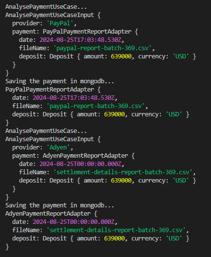

# Adapter


## Payment Report Analysis

Assuming that we are working in a company that process payments throw PayPal and Adyen, and our company wants to make a microservice who receives the reports of our payments provider.

The problem here is that every provider has a format to send the data, and we want to converge all of those formats to a single one to make easy the analysis of them.

### PayPal Report

```json
{
  "date": "2024-08-25T17:03:48.530Z",
  "csv-file": "paypal-report-batch-369.csv",
  "deposit-amount": 639000,
  "currency": "USD"
}
```

### Adyen Report

```json
{
  "date": "2024-08-25",
  "file": "settlement-details-report-batch-369.csv",
  "deposit": {
    "amount": 639000,
    "currency": "USD"
  }
}
```

## Output


[Refactoring Guru](blank:https://refactoring.guru/es/design-patterns/adapter)
